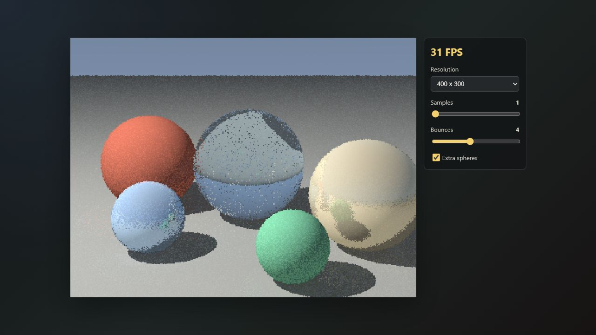

# Real-Time WASM Raytracer

A compact browser raytracer written in Rust and compiled to WebAssembly with `wasm-bindgen`. It renders directly into an HTML canvas at an interactive resolution, with live camera orbit controls and quality sliders.

## What's Implemented

- Ray-sphere and ray-plane intersections.
- Materials: Lambertian diffuse, fuzzy metal reflection, and dielectric glass refraction using Snell's law.
- Depth-limited recursive-style ray bounces implemented as an iterative hot loop.
- Moving point light, ambient term, hard shadows, and a sky background.
- Multi-sample anti-aliasing with a live sample-count slider.
- A small BVH over spheres when the scene has more than a handful of objects. The infinite ground plane is tested separately.
- Mouse-drag camera orbit, scroll zoom, resolution selector, bounce-depth slider, sphere toggle, and an always-visible FPS counter.

## Build

Install `wasm-pack`, then build the WebAssembly package:

```sh
wasm-pack build --target web --release
```

Serve the project root with any static server. Examples:

```sh
python -m http.server 8080
```

Then open:

```text
http://localhost:8080/web/
```

The generated `pkg/` directory is checked in so the demo can also be served immediately after cloning. Rebuild it when you change the Rust renderer.

## Screenshot



## How It Works

For each pixel, JavaScript asks the WebAssembly renderer for a fresh RGBA frame. The Rust renderer constructs a camera ray through the pixel, jitters that ray for anti-aliasing, then finds the closest scene hit.

Spheres are solved analytically by substituting the ray equation `P(t) = origin + t * direction` into the sphere equation `dot(P - center, P - center) = radius^2`. Planes use the ray-plane equation `t = dot(point - origin, normal) / dot(direction, normal)`.

Diffuse surfaces use Lambertian lighting: the brightness from the moving point light is proportional to `max(dot(normal, light_dir), 0)`, with a small ambient term so shadows do not go fully black. Metal surfaces reflect the incoming ray around the surface normal, then add configurable fuzz by perturbing the reflected direction. Dielectrics choose between reflection and refraction; refraction uses Snell's law with a Schlick approximation for angle-dependent reflectance.

The bounce loop is depth-limited so the frame time stays bounded. The code is intentionally structured around a single hot trace loop in `src/lib.rs`; that is the natural place to split rows across Web Workers or experiment with wasm SIMD later.
